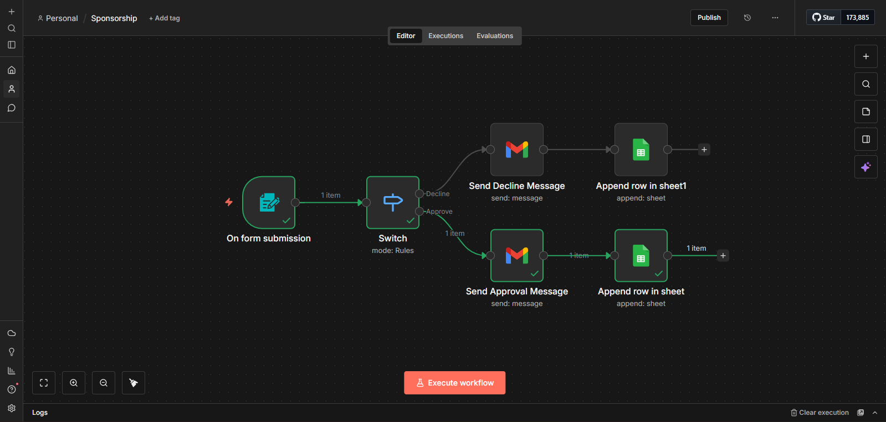
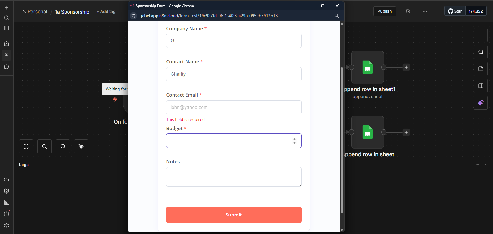
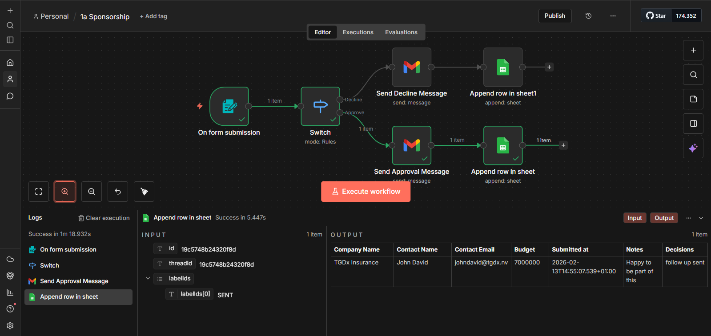

# 🤖 Smart Lead Processing System — n8n Workflow

> **Intelligent, no-code automation that captures leads, makes decisions, and responds instantly — 24/7, without human intervention.**

---

## 📌 Overview

This repository documents a fully functional **n8n automation workflow** that handles sponsorship requests (and any lead-based process) end-to-end. Built without writing a single line of code, it demonstrates how modern no-code tools can power business-grade automation with intelligent conditional logic.

The workflow was originally designed for **sponsorship request processing**, but the trigger → condition → action → storage pattern applies universally across business domains.

---

## ✨ What It Does

| Step | Node | Description |
|------|------|-------------|
| 1️⃣ | **Form Trigger** | Captures submissions in real-time (Company Name, Contact, Budget, Notes) |
| 2️⃣ | **Switch Node** | Evaluates budget thresholds and routes the workflow intelligently |
| 3️⃣a | **Gmail — Approve** | Sends a personalized acceptance email to high-value leads |
| 3️⃣b | **Gmail — Decline** | Sends a polite decline email to lower-budget requests |
| 4️⃣ | **Google Sheets** | Logs every submission to a structured CRM-like tracker |

---

## 🗺️ Workflow Architecture

```
[Form Submission]
       │
       ▼
  [Switch Node]  ──── Budget ≥ threshold ──▶  [Send Approval Email]  ──▶  [Append to Sheet]
       │
       └────────── Budget < threshold  ──▶  [Send Decline Email]   ──▶  [Append to Sheet]
```

---

## 🖼️ Screenshots

### Workflow Canvas


### Submission Form (Live)


### Successful Execution Log


---

## 🧰 Tech Stack

| Tool | Role |
|------|------|
| [n8n](https://n8n.io) | Workflow automation platform |
| **n8n Forms** | Built-in form builder & trigger |
| **Switch Node** | Conditional routing / decision engine |
| **Gmail** | Outbound email automation |
| **Google Sheets** | Persistent CRM-like data storage |

---

## ⬇️ Import This Workflow into n8n

You can get this workflow running in your own n8n instance in under 5 minutes.

**Step 1 — Download the JSON**
- Click `sponsorship-workflow.json` in this repo
- Click the **Download** button (or the raw icon), save it to your computer

**Step 2 — Import into n8n**
- Open your n8n instance
- Click **Workflows** in the left sidebar
- Click the **⋯ menu** (top right) → select **Import from file**
- Select the downloaded `sponsorship-workflow.json`

**Step 3 — Reconnect your credentials**
- The workflow will import with broken credential links (this is normal — n8n doesn't share credentials between accounts)
- Click the **Gmail** nodes → connect your own Gmail account via OAuth
- Click the **Google Sheets** nodes → connect your Google account and point it to your own spreadsheet

**Step 4 — Update your spreadsheet URL**
- In both Google Sheets nodes, replace the existing spreadsheet URL with your own Google Sheets link
- Make sure your sheet has these columns: `Company Name`, `Contact Name`, `Contact Email`, `Budget`, `Submitted at`, `Notes`, `Decisions`

**Step 5 — Adjust the budget threshold**
- Open the **Switch** node
- The current threshold is set to **$500,000** — change this to whatever fits your use case

**Step 6 — Test & Publish**
- Click **Execute Workflow** and submit a test form entry
- Verify the email is sent and the row appears in your sheet
- Hit **Publish** to go live

> ⚠️ **Note:** The form URL in the imported workflow will be different from the original. n8n generates a new webhook URL per instance — copy your new form URL from the Form Trigger node after importing.

---

## 🚀 Getting Started

### Prerequisites

- An **n8n** account ([free tier available at n8n.io](https://n8n.io))
- A **Gmail** account connected to n8n via OAuth
- A **Google Sheets** spreadsheet set up for lead logging

### Setup Steps

1. **Import the workflow** — Download `sponsorship-workflow.json` from this repo and follow the import steps above
2. **Configure your form** — Update the form fields to match your use case
3. **Set your Switch logic** — Adjust the budget threshold (or any other condition) in the Switch node
4. **Connect Gmail** — Authenticate your Gmail account and update the email templates
5. **Connect Google Sheets** — Link your spreadsheet and map the columns to your form fields
6. **Test & Publish** — Run a test submission, verify the execution log, then hit **Publish**

### Recommended Learning Path

1. Start with a simple form (3–5 fields)
2. Implement basic conditional logic with 2 paths
3. Test email automation with sample data
4. Connect Google Sheets for tracking
5. Gradually add complexity (more branches, fields, integrations)
6. Deploy to production and monitor

---

## 📊 Real-World Applications

This same **trigger → condition → action → storage** pattern can power:

- 📋 **Client onboarding** — instant welcome emails and project kickoff instructions
- 💼 **Sales lead qualification** — route high-value leads to your team, nurture the rest automatically
- 🧑‍💼 **HR / Job applications** — shortlist vs. decline paths with automated status updates
- 🎟️ **Event registration** — tiered responses based on ticket type or VIP status
- 📞 **Customer support routing** — assign tickets based on urgency, category, or account value

---

## 📈 Business Benefits

- ⏱️ **Saves hours every week** — eliminates manual data entry and follow-ups
- ✅ **Zero human error** — consistent, rule-based processing every time
- ⚡ **Instant responses** — leads hear back the moment they submit
- 📊 **Structured data** — every submission logged for analytics and reporting
- 📡 **Scales effortlessly** — handles 1 or 10,000 submissions with no extra effort

---

## 🔧 Customization & Extensibility

The workflow is fully modular. You can extend it to:

- Add more form fields for richer data collection
- Create multi-branch decision trees for complex logic
- Plug in **Slack** for team notifications on high-value leads
- Integrate **Notion**, **Airtable**, or your existing CRM
- Add **WhatsApp** notifications via Twilio
- Layer in **AI nodes** (OpenAI / Claude) for dynamic, LLM-generated email responses

---

## 📄 Documentation

Full step-by-step build documentation is available here:
👉 https://docs.google.com/document/d/1VLxEtV4b-OD5-fhh3vVoUGuC0nfehiMU/edit?usp=drive_link&ouid=103227920438659480697&rtpof=true&sd=true

---

## 🤝 Connect

Built by **Emmanuel Tjabel**

- 📧 [tjabelworks@gmail.com](mailto:tjabelworks@gmail.com)
- 💼 [linkedin.com/in/emmanuel-tjabel](https://linkedin.com/in/emmanuel-tjabel)
- 🐙 [github.com/TJ-Abel](https://github.com/TJ-Abel)
- 📞 +234 903 075 3658

> Need a custom automation workflow for your business? Let's talk.

---

## 📜 License

This project is open for learning and adaptation. Attribution appreciated. Contact for commercial use inquiries.

---

*Built with n8n · No code written · Fully automated · Always on*
